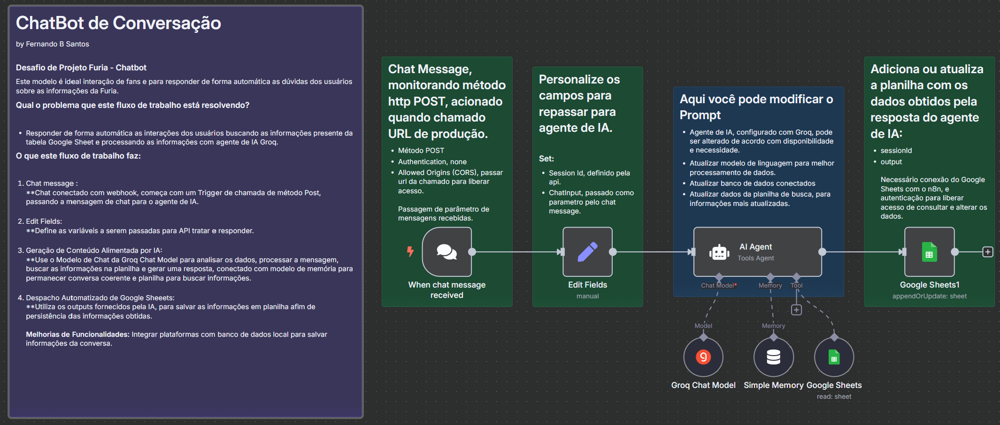
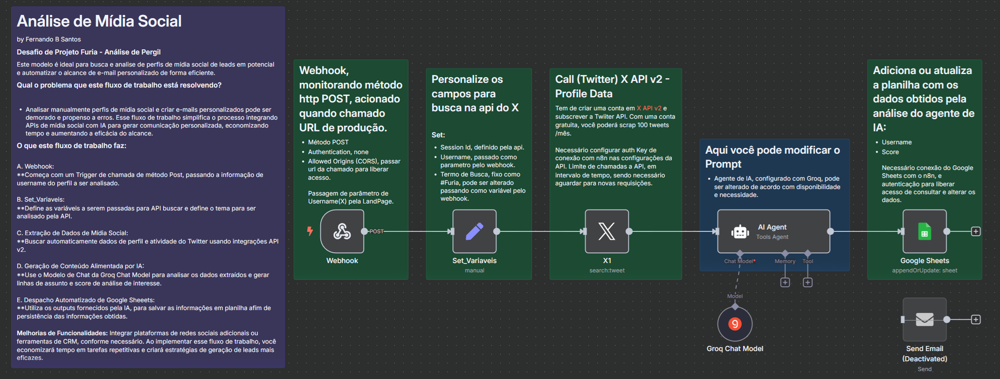

# Desafio_Furia
Desafio de Projeto Furia - Chatbox de integração com usuários e Coleta de Dados para Análise de Perfil

API BackEnd disponível em url: https://github.com/FernandoBitt/Desafio_Furia_SpringBoot

## TECNOLOGIAS:
* Angular
* TypeScript / JavaScript
* HTML / SCSS

* n8n
* Groq Chat Model
* VScode
* Docker

# ChatBot-DesafioFuria
<h1> Workflow n8n - ChatBot:

# Desafio_Furia_Analise_Perfil
<h1> Workflow n8n - análise de perfil:

# FuriaLandingPage

This project was generated with [Angular CLI](https://github.com/angular/angular-cli) version 17.3.16.

## Development server

Run `ng serve` for a dev server. Navigate to `http://localhost:4200/`. The application will automatically reload if you change any of the source files.

## Further help

To get more help on the Angular CLI use `ng help` or go check out the [Angular CLI Overview and Command Reference](https://angular.io/cli) page.
